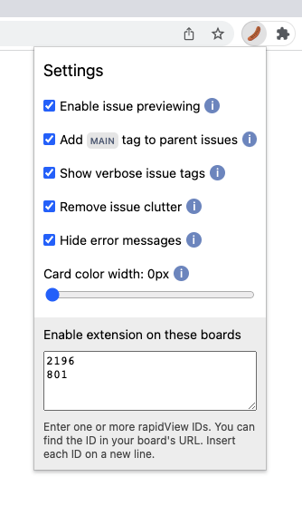

# Jira's Got Issues
###### Chrome and Firefox browser extension

## In this README
* Features
* Installation (Firefox)
* Settings

## Features
### Green highlighting of tasks that share the same main task

### Preview bubbles to show highlighted tasks out of view

### Purple highlighting of tasks that have no other (sub)tasks

### 'Main' tag to visually distinguish main tasks

### Link to main task in the grey stubs above subtasks

## Installation (Firefox)
1. Download the latest release (download starts immediately): https://github.com/Intracto/jiras-got-issues-browser-extension/raw/master/firefox/jiras_got_issues-1.1-fx.xpi
1. Visit `about:addons` in your browser
1. Click the cog button right of the page title, and select "Install Add-on From File..."
   
1. Select the downloaded `.xpi` file, and follow the steps shown on screen
1. After installation, add your board ID in the settings popup (See _Settings_ section of this readme)
1. Refresh your board. Everything should be ready to use!

>  Your browser will update the extension automatically whenever a new version is available

## Settings

- **Enable issue previewing:** enables or disables the preview bubbles that show highlighted tasks out of view
- **Add MAIN tag to parent issue:** enables or disables the 'Main' tag which visually distinguishes main tasks
- **Enable extension on these boards:** contains the IDs of boards you want the extension to work on. Multiple IDs should be on multiple lines. Example URL: https://jira.hosted-tools.com/secure/RapidBoard.jspa?rapidView=2196&quickFilter=8539 would be ID `2196`
